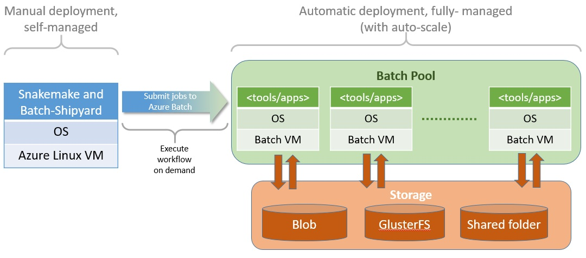
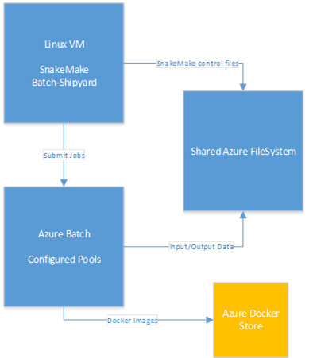

# Snakemake with the Azure Batch Service #

## Overview ##

[**Snakemake**](https://snakemake.readthedocs.io/en/stable/) is an MIT-licensed workflow management system that aims to reduce the complexity of creating workflows by providing a fast and comfortable execution environment, together with a clean and modern specification language in python style. Snakemake workflows are essentially Python scripts extended by declarative code to define rules. Rules describe how to create output files from input files.

~~~~
rule targets:
    input:
        "plots/dataset1.pdf",
        "plots/dataset2.pdf"

rule plot:
    input:
        "raw/{dataset}.csv"
    output:
        "plots/{dataset}.pdf"
    shell:
        "somecommand {input} {output}"
~~~~

[**Azure Batch**](https://azure.microsoft.com/en-us/services/batch/) is a service that enables you to run batch processes on high-performance computing (HPC) clusters composed of Azure virtual machines (VMs). Batch processes are ideal for handling computationally intensive tasks that can run unattended such as photorealistic rendering and computational fluid dynamics. Azure Batch uses [VM scale sets](https://docs.microsoft.com/en-us/azure/virtual-machine-scale-sets/virtual-machine-scale-sets-overview) to scale up and down and to prevent you from paying for VMs that aren't being used. It also supports autoscaling, which, if enabled, allows Batch to scale up as needed to handle massively complex workloads.

Azure Batch involves three important concepts: **storage**, **pools**, and **jobs**. Storage is implemented through Azure Storage, and is where data input and output are stored. Pools are composed of compute nodes. Each pool has one or more VMs, and each VM has one or more CPUs. Jobs contain the scripts that process the information in storage and write the results back out to storage. Jobs themselves are composed of one or more tasks. Tasks can be run one at a time or in parallel.

**[Batch Shipyard](https://github.com/Azure/batch-shipyard)** is an open-source toolkit that allows Dockerized workloads to be deployed to Azure Batch compute pools. Dockerized workloads use Docker containers rather than VMs. (Containers are hosted in VMs but typically require fewer VMs because one VM can host multiple container instances.) Containers start faster and use fewer resources than VMs and are generally more cost-efficient. For more information, see https://docs.microsoft.com/en-us/azure/virtual-machines/windows/containers.

The workflow for using Batch Shipyard with Azure Batch is pictured below. After creating a Batch account and configuring Batch Shipyard to use it, you upload input files to storage and use Batch Shipyard to create Batch pools. Then you use Batch Shipyard to create and run jobs against those pools. The jobs themselves use tasks to read data from storage, process it, and write the results back to storage.

_Azure Batch Shipyard workflow_

### High Level Archetural Overview ###

A standard Azure VM (ubuntu Linux) is used as the 'control' node and has Batch-Shipyard and Snakemake installed with a CIF's fileshare mapped. The mapped fileshare points to an Azure Blob Storage fileshare. The pools on Azure Batch
are configured to mount the same shared filesystem when running jobs. With a shared file system scripts can be executed and Snakemake can manage the workflow based on the input/output 
settings on rules.

_Architecure Overview_

## Objectives ##

1. To demonstrate Snakemake workflows running on Azure Batch using Batch-Shipyard to manage the pools, jobs and tasks.
2. Usage the of publicly available Genomics Docker images (http://biocontainers.pro/registry/#/) in rule steps.
3. Usage of a custom Docker images stored in a private Azure Container Registry.
4. Usage of a shared Azure file storage system to manage inputs/outputs and the snakemake workflow control files.

## Pool Sizing for different rule requirements ##

The VM size for each pool in Azure Batch can be tailored to match the requirments for each Snakemake rule. The VM's available on Azure
Batch vary in size and price. Charges are calculated on the compute time spent on executing jobs. The pricing for each VM type is detailed 
in the Azure Batch [**Pricing**](https://azure.microsoft.com/en-us/pricing/details/batch/) list.

| VM Type | Sizing | Description |
|---|---|---|
| General purpose	| DSv2, Dv2, DS, D, Av2, A0-7	| Balanced CPU-to-memory ratio. Ideal for testing and development, small to medium databases, and low to medium traffic web servers. |
| Compute optimized	| Fs, F	| High CPU-to-memory ratio. Good for medium traffic web servers, network appliances, batch processes, and application servers. |
| Memory optimized	| M, GS, G, DSv2, DS, Dv2, D	| High memory-to-core ratio. Great for relational database servers, medium to large caches, and in-memory analytics. |
| Storage optimized	| Ls	| High disk throughput and IO. Ideal for Big Data, SQL, and NoSQL databases. |
| GPU	| NV, NC	| Specialized virtual machines targeted for heavy graphic rendering and video editing. Available with single or multiple GPUs. |
| High performance compute	| H, A8-11	| Our fastest and most powerful CPU virtual machines with optional high-throughput network interfaces (RDMA). |

The full VM list and detailed sepecification can be found on Azure: https://docs.microsoft.com/en-us/azure/virtual-machines/windows/sizes

BizData have created a [**PowerBI**](https://app.powerbi.com/view?r=eyJrIjoiZmU2MWQzZmMtMmZmMy00ZjMwLWFmYTktZWUyNDgwOGIwOGUxIiwidCI6Ijg0ODkyYTJmLTY0OWQtNGY4Yi05ZDdkLWY0NTBlNWQ5Y2FkNSIsImMiOjEwfQ%3D%3D) calculator to help with calculating the cost and choice of pool sizing.

## Snakemake Execution ##

To execute Snakemake rules on Azure batch the 'shell:' command is modified to write a shell script to the shared file system. This shell script is then executed on an Azure Batch
by using a Batch-Shipyard job start command. The Azure Batch compute node shares the filesystem and will execute the shell command and save the output files. Snakemake manages the workflow on the shared filesystem by
checking the output requirements from each rule. 

Shell script creation into the shared file system.
~~~~
echo -e \"#!/usr/bin/env bash\n cd scriptfolder/ ; bwa mem {input} | samtools view -Sb - > {output}\" > scriptfolder/jobrun.sh"
~~~~

Execute the Batch-Shipard job to execute the script on Azure Batch
~~~~
shipyard jobs add --configdir pathtoconfig"
~~~~

## Example Snakemake on Azure Batch ##

The example Snakemake is a variant calling workflow that maps reads to the yeast reference genome with variants called jointly with SAMtools and BCFtools.

A public SAMtools docker container from https://biocontainers.pro/ is used along with a custom docker container stored in an Azure Container Registry. The custom docker container 
has BCFtools, BWA and SAMtools installed.

*Docker containers used*

1. biocontainers/samtools
2. genomicsazuredocker.azurecr.io/azuregenomics

The full list of biocontainers can be found in the registry https://biocontainers.pro/registry/#/

[Open Example](docs/example.md)

## Template ##

A Template of the configuration files required to setup a new Snakemake using Azure Batch.

[Template](docs/template.md)

## Installation Guide ##

Full installation guide to setup the control VM and required Azure services to run snakemake on Azure Batch

[Installation Guide](docs/installation.md)

## Summary ##

Azure Batch is ideal for running large jobs that are compute-intensive as batch jobs on clusters of virtual machines. Batch Shipyard improves on Azure Batch by running those same jobs in Docker containers. 

## Additional References ##

https://github.com/Azure/batch-shipyard

https://app.powerbi.com/view?r=eyJrIjoiZmU2MWQzZmMtMmZmMy00ZjMwLWFmYTktZWUyNDgwOGIwOGUxIiwidCI6Ijg0ODkyYTJmLTY0OWQtNGY4Yi05ZDdkLWY0NTBlNWQ5Y2FkNSIsImMiOjEwfQ%3D%3D

---
Copyright 2017 BizData. All rights reserved. Except where otherwise noted, these materials are licensed under the terms of the Apache License, Version 2.0. You may use it according to the license as is most appropriate for your project on a case-by-case basis. The terms of this license can be found in http://www.apache.org/licenses/LICENSE-2.0.
