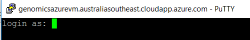
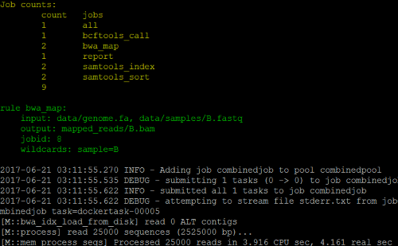
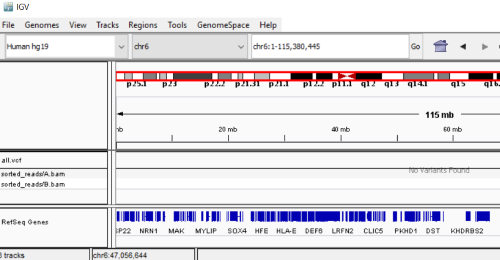

[Home](../README.md) | [Example](example.md) | [Template](template.md) | [Installation](installation.md) 

<a name="Example"></a>
# Example Snakemake on Azure Batch #

## Overview ##

This example Snakemake is a variant calling workflow that maps reads to the yeast reference genome with variants called jointly with SAMtools and BCFtools.

A public SAMtools docker container from https://biocontainers.pro/ is used along with a custom docker container stored in an Azure Container Registry. The custom docker container 
has BCFtools, BWA and SAMtools installed.

*Docker containers used*

1. biocontainers/samtools
2. genomicsazuredocker.azurecr.io/azuregenomics

Dockerfile for the custom combined container:
~~~~
FROM ubuntu:16.04
RUN apt-get update 
RUN apt-get install -y --no-install-recommends \
build-essential \
wget \
make \
bzip2 \
bwa 	\ 
bcftools \
libncurses5-dev \
zlib1g-dev

RUN mkdir /home/fileshare
RUN cd /home/fileshare
RUN wget --no-check-certificate https://github.com/samtools/samtools/releases/download/1.3.1/samtools-1.3.1.tar.bz2
RUN bunzip2 samtools-1.3.1.tar.bz2
RUN tar -xvf samtools-1.3.1.tar
RUN cd samtools-1.3.1 ; ./configure ; make ; make install
~~~~

The Snakefile and Batch-shipyard setup for this example are detailed in the [Configuration](#Config) section.

## Login to the VM ##

To execute the example you will need to login to the example VM server using [PuTTY](http://www.putty.org/) or [OpenSHH](https://www.openssh.com/)

In a Windows command prompt enter:

````
putty genomicsazurevm.australiasoutheast.cloudapp.azure.com
````



Login with:
````
User: bizdata
Password: <passwordhere>
````

## Running the example ##

Change to the Example folder on the VM

````
cd $FILESHARE/example
ls -la
````

The folder structure of the example:

````
azurebatch - contains the Azure Batch-shipyard configuration scripts
calls - output folder for the resulting .vcf file 
data - input data to be processed
mapped_reads - folder for the the mapped reads
sorted_reads - folder for the sorted reads
report.html - report output from the analysis
runexample.sh - shell script to run the example
.snakefile - folder managed by Snakemake (control files)
snakefile - the Snakemake workflow file
````

Firstly we need to setup the Azure Batch pools to run the jobs on. Execute the following command to setup the Azure Batch pools that we 
will need, and wait for the compute nodes to start up.

````
$SHIPYARD/shipyard pool add --configdir $FILESHARE/example/azurebatch/samtools
````

The node will be ready when a 'ComputeNodeState.waiting_for_start_task' message is returned. Once the node is ready to execute
tasks press control-C to stop the pool setup.

Repeat the pool setup for the custom combined docker image.
````
$SHIPYARD/shipyard pool add --configdir $FILESHARE/example/azurebatch/combined
````

Once the pools are up and running Azure Batch is ready to execute jobs. 

The 'runexample' script removes the Snakemake outputs and then executes the snakemake workflow file. To run the example execute the script:

````
./runexample.sh
````



After the Snakemake has completed you will be prompted to delete the jobs used in the workflow. Enter 'y' when prompted to delete the jobs.

~~~~
Confirm delete combined job [y/n]: y
Confirm delete samtoolsjob job [y/n]: y
~~~~

### Viewing the Results ### 

The final report can be downloaded using FTP from a windows cmd line.

````
ftp genomicsazurevm.australiasoutheast.cloudapp.azure.com
````

Login with the same user and password to the VM and download the results file.

~~~~
cd fileshare/example1/calls
mget *
~~~~

The ouput report can also be downloaded and is located in file system at /home/fileshare/example/report.html

Once downloaed the output can be viewed in IGV https://software.broadinstitute.org/software/igv/download




### Final step - Removing the Azure Batch Pools ### 

To remove the Azure batch pools for this example execute the following comands and enter 'y' when prompted. This step removes the pools from Azure Batch.

````
$SHIPYARD/shipyard pool del --configdir $FILESHARE/example/azurebatch/samtools
````

````
$SHIPYARD/shipyard pool del --configdir $FILESHARE/example/azurebatch/combined
````

<a name="Config"></a>
## Configuration and how it works ##

### Snakemake file ###

Instead of executing the commands locally, each rule create's a new shell script file and then runs the Batch-Shipyard command to start a job.

~~~~
rule samtools_sort:
    input:
        "mapped_reads/{sample}.bam"
    output:
        "sorted_reads/{sample}.bam"
    shell:
         "echo -e \"#!/usr/bin/env bash\ncd $FILESHARE/example ;\n samtools sort -T sorted_reads/{wildcards.sample} -O bam {input} > {output}\" > $FILESHARE/example/jobrun.sh ;\n $SHIPYARD/shipyard jobs add --configdir $FILESHARE/example/azurebatch/samtools --tail stderr.txt\n"
~~~~

For this rule a shell script file is saved with the input/output files replaced by Snakemake:
~~~~
#!/usr/bin/env bash
cd /home/bizdata/fileshare/example ;
samtools sort -T sorted_reads/B -O bam mapped_reads/B.bam > sorted_reads/B.bam
~~~~

Then Batch-Shipyard is called to execute the 'samtools' job:
~~~~
$SHIPYARD/shipyard jobs add --configdir $FILESHARE/example/azurebatch/samtools --tail stderr.txt
~~~~

The Batch-Shipyard configuration contains the available docker images that can be used when executing jobs. For this pool we only have one defined, but multiple docker
images can be made available for use.

config.json - images available to use on this Azure Batch Pool
~~~~
"global_resources": {
	"docker_images": [
		"biocontainers/samtools"
~~~~

jobs.json - Configuration of the samtools job
~~~~
"tasks": [
	{
		"image": "biocontainers/samtools",
		"shared_data_volumes": ["azurefilevol"],
		"remove_container_after_exit": true,
		"command": "/home/bizdata/fileshare/example/jobrun.sh"
	}
~~~~

### Azure Batch Cobfiguration ###

The Batch-Shipyard configuration files are located in the 'azurebatch' folder.

config.json

Overall configuration used by all of the jobs/tasks. This specified the shared storage and docker images available to be used in the jobs.

````
{
    "batch_shipyard": {
        "storage_account_settings": "mystorageaccount"
    },
    "global_resources": {
        "docker_images": [
            "biocontainers/samtools"
        ],
    	"docker_volumes": {
			"shared_data_volumes": {
				"azurefilevol": {
					"volume_driver": "azurefile",
					"storage_account_settings": "mystorageaccount",
					"azure_file_share_name": "fileshare",
					"container_path": "/home/bizdata/fileshare",
					"mount_options": [
						"filemode=0777",
						"dirmode=0777"
					]
				}
            }
        }
	}
}
````

jobs.json

This is the definition of each job to be run. In this case it is the samtools step and uses the biocontainers/samtools docker image and runs the shell command.
````
{
    "job_specifications": [
        {
            "id": "bcftoolsjob",
			"tasks": [
                {
                    "image": "biocontainers/samtools",
	                "shared_data_volumes": ["azurefilevol"],
					"remove_container_after_exit": true,
                    "command": "/home/bizdata/fileshare/example/jobrun.sh"
                }
            ]
        }
    ]
}
````

pools.json

Overall pool configuration. This defines the compute VM size that will be used when running the docker image for jobs.

The VM sizing for the compute is this example is using a basic sized VM 'Basic_A1'. Different sized VM's can be specified based on the required task.

````
{
    "pool_specification": {
        "id": "bcftoolspool",
        "vm_size": "Basic_A1",
        "vm_count": {
            "dedicated": 1
        },
        "publisher": "Canonical",
        "offer": "UbuntuServer",
        "sku": "16.04-LTS",
        "ssh": {
            "username": "docker"
        },
        "reboot_on_start_task_failed": false,
        "block_until_all_global_resources_loaded": true
    }
}
````


